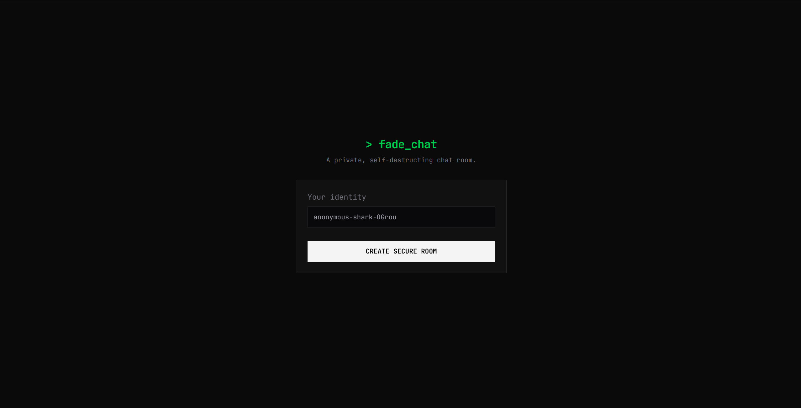

# fade — private, self‑destructing chat rooms

`fade` is a minimal Next.js app providing private, self‑destructing chat rooms for short-lived, two-person conversations. It uses Upstash (Redis + Realtime) for pub/sub and temporary storage, `elysia` for typed API routes, and the Next.js App Router for the UI.

---



---

## Features

- Private rooms with a 2-user limit (enforced via middleware cookie `x-auth-token`).
- Messages are stored in Redis and expire when the room TTL ends.
- Real‑time messaging using `@upstash/realtime`.
- Create/destroy rooms via API; room destruction deletes messages and metadata.
- Lightweight client generated with `treaty` against the server API.

## Tech stack

- Next.js (App Router)
- React + React Query (`@tanstack/react-query`)
- Upstash Redis & Realtime (`@upstash/redis`, `@upstash/realtime`)
- Elysia + Eden (`elysia`, `@elysiajs/eden`) for server routing and type-safe client
- TypeScript

## Quickstart

Prerequisites:

- Node 18+ (or matching your environment)
- An Upstash Redis instance (REST API + Realtime)

Environment variables:

- `UPSTASH_REDIS_REST_URL` — Upstash REST URL
- `UPSTASH_REDIS_REST_TOKEN` — Upstash REST token
- `NEXT_PUBLIC_APP_URL` — optional, used to build client base URL for SSR

1. Clone repo

```bash
git clone git@github.com:srahman14/fade.git
```

2. Install and run:

```bash
npm install
npm run dev
```

Open http://localhost:3000 and click Create Secure Room to start.

## Project structure (high level)
```bash
src/
├─ app/
│  ├─ page.tsx                     # lobby UI
│  ├─ room/
│  │  └─ [roomId]/
│  │     └─ page.tsx               # room UI
│  └─ api/
│     ├─ realtime/
│     │  └─ route.ts               # upstash realtime handler
│     └─ [[...slugs]]/
│        └─ route.ts               # elysia API for rooms & messages
│        └─ auth.ts                # elysia API for Auth
│
├─ lib/
│  ├─ realtime.ts                  # realtime schema + bindings
│  ├─ realtime-client.ts           # realtime client hook
│  ├─ redis.ts                     # upstash redis helper
│  └─ client.ts                    # treaty client
│
└─ proxy.ts                        # middleware for auth / room access
```
- Increase room capacity by changing the check in `src/proxy.ts`.
- Increase TTL in /api/[[...slugs]]/route.ts (ROOM_TTL_SECONDS)

## License

See the `LICENSE` file in the repository.
